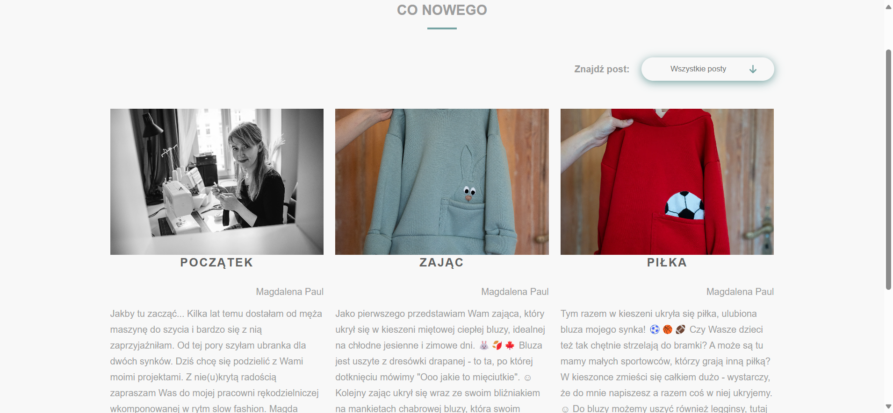

# my-vue-app

# Opening Posts

**Overview**

Opening Posts is a part of a blog application that will be developed for the entire website.
<p>
  
</p>

## Project setup
```
npm install
```

### Compiles and hot-reloads for development
```
npm run serve
```

### Compiles and minifies for production
```
npm run build
```

### Lints and fixes files
```
npm run lint
```

### Customize configuration
See [Configuration Reference](https://cli.vuejs.org/config/).
